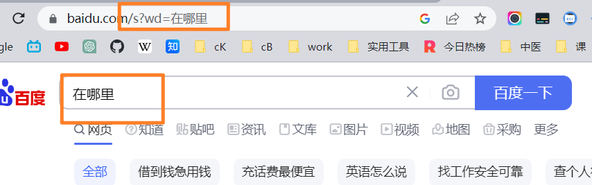
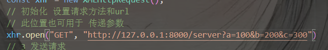

[TOC]


# 6.7   22:52  AJax

## AJax定义

Ajax（Asynchronous JavaScript and XML）是一种用于创建交互式网页应用程序的技术。它允许在不重新加载整个页面的情况下，通过在后台与服务器进行数据交换，更新部分页面内容。通过Ajax，可以实现异步加载数据、发送数据、更新页面等功能，从而提升用户体验和网页性能


## 懒加载和按需加载

懒加载（Lazy Loading）和按需加载（On-Demand Loading）都是优化网页性能和用户体验的技术手段，它们可以减少初始加载的内容量，提高页面的加载速度。

懒加载是指延迟加载页面中的某些内容，只在用户需要访问到它们时再进行加载。典型的应用场景是图片懒加载，当页面中存在大量图片时，可以将图片的真实地址保存在自定义属性中（例如`data-src`），初始时使用占位图或者空的`src`属性。当图片进入可视区域时，通过JavaScript动态加载真实的图片地址，实现图片的懒加载。这样可以减少初始页面加载的图片数量，提高页面的加载速度，并且节省带宽。

按需加载是指根据用户的需求，在特定情况下才加载某些资源或功能。例如，在网页中包含大量的JavaScript代码，可以将其中的某些功能代码按需加载。当用户执行特定操作或进入特定页面时，再动态地加载相关的JavaScript文件。这样可以减少初始页面加载的JavaScript代码量，加快页面渲染速度。按需加载还可以应用于其他类型的资源，例如CSS文件、字体文件、视频等。

无论是懒加载还是按需加载，它们都需要使用JavaScript来实现。通过合理地应用懒加载和按需加载，可以提高网页的加载速度、降低带宽消耗，并改善用户的交互体验。


### 操作步骤

>
>
>当涉及到优化网页性能和用户体验时，懒加载和按需加载是两种常用的技术手段。它们可以帮助减少初始页面加载的内容量，提高页面的加载速度，并在用户需要时才加载额外的资源或功能。
>
>懒加载（Lazy Loading）是一种延迟加载技术，它将页面中某些内容的加载推迟到用户实际需要访问到它们的时候才进行。常见的应用场景是图片懒加载，其中图片的加载被延迟到图片进入用户视野（即滚动到可见区域）之前。这样做可以减少初始加载的图片数量，提高页面的加载速度，并节省带宽。懒加载通常通过以下步骤实现：
>
>1. 在初始加载时，使用占位图或者空的`src`属性替代真实图片地址。
>2. 将真实的图片地址保存在自定义属性中，例如`data-src`。
>3. 使用JavaScript监测滚动事件，当图片进入用户视野时，将真实的图片地址赋值给`src`属性，从而触发图片的加载。
>
>除了图片懒加载，还可以将其他类型的内容应用懒加载，如延迟加载视频、音频、地图等。懒加载可以通过现有的JavaScript库或框架来实现，例如使用Intersection Observer API或使用第三方库如Lazysizes、Lazyload等。
>
>按需加载（On-Demand Loading）是根据用户的需求，有选择地加载特定的资源或功能。它可以用于减少初始页面加载时的代码量，提高页面渲染速度。按需加载的应用场景包括：
>
>1. JavaScript按需加载：将页面中的某些功能代码分割成多个模块，在特定的操作或进入特定页面时，动态地加载相应的JavaScript模块。这可以通过模块打包工具（如Webpack、Rollup等）和异步加载的方式实现，例如使用动态`import()`函数或使用require.js等库。
>2. CSS按需加载：将页面中的某些样式文件分割成多个模块，根据需要动态加载对应的CSS文件。这可以通过JavaScript来实现，动态创建`<link>`元素并将其添加到页面中。
>3. 图片按需加载：当用户需要查看更多图片时，动态加载额外的图片资源。这可以通过JavaScript来实现，例如在点击"加载更多"按钮时，异步请求并加载更多的图片。
>
>通过懒加载和按需加载，可以有效地减少初始加载的内容量，提高页面的加载速度和响应性，从而改善用户的交互体验。但需要注意的是，合理地使用这些技术时要权衡好用户需求和性能优化的平衡，以确保
>
>页面仍然能够提供所需的功能和内容。


## xml

>XML（eXtensible Markup Language）是一种用于描述数据的标记语言。它被设计用于传输和存储数据，具有自我描述性、可扩展性和跨平台性的特点。
>
>XML使用标签来标识数据元素，并使用起始标签和结束标签来定义元素的范围。标签可以嵌套，形成层次结构，表示数据之间的关系。例如，下面是一个简单的XML示例：
>
>```xml
><person>
>  <name>John Doe</name>
>  <age>30</age>
>  <address>
>    <city>New York</city>
>    <state>NY</state>
>  </address>
></person>
>```
>
>在上面的示例中，`person`是最外层的元素，它包含了`name`、`age`和`address`等子元素。每个元素都由起始标签和结束标签包围，并且可以包含文本或其他元素。
>
>XML还可以使用属性来提供关于元素的附加信息。属性位于起始标签中，并使用键值对的形式表示。例如，可以将上述示例中的`person`元素改为包含属性的形式：
>
>```xml
><person id="1">
>  <name>John Doe</name>
>  <age>30</age>
>  <address>
>    <city>New York</city>
>    <state>NY</state>
>  </address>
></person>
>```
>
>在这个示例中，`person`元素具有一个名为`id`的属性，其值为`1`。
>
>XML可以用于在不同平台和应用程序之间传递和共享数据。它是一种通用的数据格式，被广泛用于Web服务、配置文件、数据交换等领域。许多编程语言和技术都提供了对XML的解析和处理功能，例如使用DOM（Document Object Model）、SAX（Simple API for XML）、XPath等。
>
>需要注意的是，随着发展和演进，JSON（JavaScript Object Notation）等其他数据交换格式在许多场景下更为流行和广泛使用，因为它们更简洁、易于理解和处理。然而，XML仍然在一些特定的应用和标准中扮演着重要的角色。


JSON

>JSON（JavaScript Object Notation）不是XML的迭代版本，而是一种与XML相互竞争的数据交换格式。JSON的设计目标是提供一种简洁、易于理解和处理的数据表示形式。
>
>相比于XML，JSON具有以下特点：
>
>1. 简洁性：JSON使用简洁的语法来表示数据，相对于XML而言，它的表示形式更为紧凑。JSON使用花括号（{}）表示对象，方括号（[]）表示数组，以及使用逗号和冒号来分隔键值对等。
>
>2. 可读性：JSON的结构和值的表示形式更接近于常见的编程语言中的数据结构，使得它更易于阅读和理解。
>
>3. 解析效率：相对于XML而言，JSON的解析速度更快，因为JSON的结构相对简单，解析器实现起来更高效。
>
>4. 与JavaScript的紧密关联：JSON的语法与JavaScript对象字面量的表示形式非常相似，这使得它在与JavaScript代码的交互和处理上更为方便。
>
>由于这些优势，JSON在Web开发中得到了广泛应用。它成为了一种常见的数据交换格式，用于传输和存储结构化数据，与后端服务器进行数据交互，以及在不同平台和应用程序之间进行数据传递。许多编程语言都提供了对JSON的解析和序列化支持。
>
>虽然JSON在许多方面替代了XML的使用，但XML仍然在某些领域中发挥作用，特别是在一些遗留系统、标准和特定行业的规范中。在某些情况下，XML的自描述性和扩展性仍然是其优势。因此，选择JSON还是XML取决于具体的应用需求和使用环境。


## xml和json的使用场景和优缺点

>
>
>XML和JSON都是常见的数据交换格式，它们在不同的场景和需求中有各自的优势和适用性。
>
>XML的使用场景：
>- Web服务：XML常用于Web服务的数据传输和交互。它可以描述复杂的数据结构和嵌套关系，并提供灵活的扩展性。
>- 配置文件：许多应用程序使用XML格式的配置文件，以便存储和管理应用程序的设置和参数。
>- 数据存储和持久化：XML可以用于将数据存储到文件或数据库中，以及进行数据的持久化。
>- 标准和规范：某些行业和领域（如电子数据交换、文档标记等）使用XML作为数据交换的标准格式。
>
>XML的优点：
>- 自描述性：XML使用标签和元素来描述数据，具有自我描述的特性，使数据结构更易于理解和解析。
>- 扩展性：XML具有良好的扩展性，可以定义自定义的标签和数据结构，适应不同的需求和应用场景。
>- 成熟的技术生态系统：XML有丰富的工具和库支持，许多编程语言都提供了对XML的解析和处理功能。
>
>XML的缺点：
>- 冗余和冗长：相对于JSON而言，XML的表示形式较为冗余，需要更多的字符来描述同样的数据结构，导致文件大小较大。
>- 解析和处理复杂性：XML的解析和处理相对复杂，需要使用特定的解析器或库来解析XML文档，并对数据进行操作和处理。
>
>JSON的使用场景：
>- Web API：JSON是Web API中常用的数据格式，用于在客户端和服务器之间进行数据交换。
>- 前端开发：JSON与JavaScript对象字面量的表示形式类似，非常适合在前端开发中使用，可以方便地与JavaScript代码进行交互。
>- 移动应用程序：由于JSON的轻量性和解析效率，它常用于移动应用程序的数据传输和存储。
>
>JSON的优点：
>- 简洁性和紧凑性：JSON的表示形式相对于XML更为简洁，使用更少的字符来表示相同的数据结构，从而减少了数据传输的大小。
>- 解析和处理效率：由于JSON的结构相对简单，解析速度比XML更快，对于处理大量数据的应用场景更加高效。
>- 与JavaScript的紧密集成：JSON的语法与JavaScript对象字面量的表示形式相似，与JavaScript代码的交互和处理更加方便。
>
>JSON的缺点：
>- 缺乏扩展性：相对于XML而言，JSON的扩展性较差，不容易在已
>
>有的结构中添加新的字段或数据。
>- 不支持注释：JSON规范不支持注释，这在某些情况下可能不方便进行文档的解释和说明。
>
>选择使用XML还是JSON取决于具体的需求、应用场景和技术栈。如果需要自描述性、灵活性和扩展性，则XML可能更适合。如果追求简洁性、解析效率和与JavaScript的紧密集成，则JSON可能更合适。


## SEO（Search Engine Optimization，搜索引擎优化）

>
>
>搜索引擎中的排名和可见性的过程指的是通过一系列的优化策略和技术，使网站在搜索引擎的自然（非付费）搜索结果中获得更高的排名，从而提高网站在搜索引擎中的可见性。
>
>搜索引擎会根据一定的算法和规则对网页进行评估和排序，以确定它们在搜索结果中的排名。搜索引擎的目标是向用户提供与其搜索查询相关且高质量的网页结果。
>
>通过SEO（Search Engine Optimization，搜索引擎优化）的技术和策略，网站可以尝试提高在搜索引擎中的排名和可见性，从而增加网站的曝光度、流量和潜在用户。
>
>在这个过程中，网站优化的关键是了解搜索引擎的工作原理和用户行为，并对网站的内容、结构和其他因素进行相应的优化。一些常见的SEO技术包括关键词优化、内容优化、网站结构优化、外部链接建设等。
>
>当一个网站在搜索引擎中的排名较高时，它会在相关的搜索查询中出现在较高的位置，这就增加了网站被用户访问和点击的机会，提高了网站的可见性。换句话说，排名较高的网站更容易被用户注意到，点击并访问。
>
>通过持续的SEO工作，网站可以逐渐提高在搜索引擎中的排名和可见性，从而获得更多的有机流量和更好的网络曝光。这对于网站的品牌建设、业务增长和在线成功都具有重要意义。


### 常见的SEO技术和策略

>SEO（Search Engine Optimization）是指优化网站以提高在搜索引擎中的排名和可见性的过程。它是一种通过优化网站的内容、结构和其他因素来吸引搜索引擎的注意并提高排名的方法。
>
>搜索引擎是互联网用户获取信息的主要工具，因此在搜索结果中获得更高的排名可以带来更多的有机流量和曝光机会。SEO的目标是使网站在搜索引擎的自然（非付费）搜索结果中获得更高的排名，从而吸引更多的访问者。
>
>以下是一些常见的SEO技术和策略：
>
>1. 关键词优化：通过研究和选择与网站内容相关的关键词，并在网站的标题、页面内容、URL、图片标签等位置合理地使用这些关键词，以增加搜索引擎对网站的关注和理解。
>
>2. 内容优化：创建高质量、有价值的内容，使其与目标受众的需求相匹配，并优化页面结构、标题标签、段落标签等，以提供清晰且易于阅读的内容。
>
>3. 网站结构优化：确保网站的导航结构清晰，并使用友好的URL结构，方便搜索引擎和用户浏览和理解网站的内容。
>
>4. 外部链接建设：通过获取来自其他高质量网站的外部链接，增加网站的权威性和可信度，从而提高搜索引擎对网站的排名。
>
>5. 移动优化：优化网站以适应移动设备的浏览，包括响应式设计、快速加载速度和易用的移动界面。
>
>6. 社交媒体整合：与社交媒体平台结合，分享网站内容并增加社交媒体上的曝光度和链接。
>
>SEO的优点：
>- 增加有机流量：通过优化网站以获得更好的搜索引擎排名，可以带来更多的有机流量，即来自搜索引擎的自然访问者。
>- 提高网站可见性：在搜索引擎中获得更高的排名，可以增加网站的曝光度和知名度，吸引更多的用户关注。
>- 长期效益：一旦实施了有效的SEO策略，它可以为网站带来长期的可见性和流量，相对于付费广告而言，SEO的效益更持久。
>
>SEO的挑战和注意事项：
>- 竞争激烈：许多网站都在争夺搜索引擎排名的前几位，因此在
>
>竞争激烈的市场中获得较高的排名可能需要更多的努力和时间。
>- 持续更新和监测：搜索引擎算法会不断更新，因此SEO需要持续地进行优化和监测，以适应变化的搜索引擎环境。
>- 避免黑帽SEO：使用欺诈性和违规手段来提高排名，如隐藏关键词、购买链接等，可能导致搜索引擎的惩罚和排名下降。
>
>需要注意的是，SEO是一个复杂的领域，它需要不断学习和实践，同时也受到搜索引擎算法的影响。建议在进行SEO时参考权威的指南和最佳实践，并保持对行业动态的关注。


## seo和爬虫之间的关系

>
>
>SEO（Search Engine Optimization）和爬虫之间存在密切的关系。理解这两者之间的关系对于了解搜索引擎工作原理和进行网站优化非常重要。
>
>SEO是一系列的优化策略和技术，旨在提高网站在搜索引擎中的排名和可见性，从而吸引更多的有机流量和用户访问。而搜索引擎爬虫（也称为网络爬虫或蜘蛛）是搜索引擎的一部分，负责自动地浏览和索引互联网上的网页。
>
>爬虫通过访问网站的链接，并逐个解析和抓取网页的内容，建立搜索引擎的索引数据库。当用户在搜索引擎中输入查询时，搜索引擎会根据索引数据库中的信息，根据一定的算法和规则来匹配最相关的网页，并以特定的排名方式呈现给用户。
>
>因此，对于网站的SEO来说，了解和理解搜索引擎爬虫的行为和需求非常重要。以下是SEO和爬虫之间的关系：
>
>1. 网站可访问性：爬虫需要能够访问和抓取网站的内容。因此，优化网站的可访问性，确保没有阻碍爬虫的技术问题（如错误的robots.txt文件、无法被抓取的页面等），是SEO的关键之一。
>
>2. 内容优化：搜索引擎爬虫会解析和理解网页的内容。通过优化网站的内容，使用关键词、标题标签、段落标签等，可以帮助爬虫更好地理解和索引网页。
>
>3. 网站结构优化：良好的网站结构和导航可以帮助爬虫更有效地抓取和索引网页。优化网站的URL结构、内部链接、网站地图等，可以提升爬虫对网站的理解和索引效果。
>
>4. 外部链接建设：爬虫通过外部链接发现和索引网页。获得来自其他高质量网站的外部链接可以增加爬虫抓取网页的机会，并提高网站的权威性和可信度。
>
>综上所述，SEO和爬虫是相互关联的。通过对网站进行合理的SEO优化，可以帮助爬虫更好地理解和索引网页，从而提高网站在搜索引擎中的排名和可见性。同时，理解搜索引擎爬虫的行为和需求，可以指导网站的优化策略和技术实施。


### 爬虫对seo起到的作用

>爬虫对SEO起到重要作用的方面主要包括以下几点：
>
>1. 网站索引：爬虫负责浏览和抓取互联网上的网页，并建立搜索引擎的索引数据库。通过爬虫的工作，搜索引擎可以了解网站的存在、内容和结构。这使得网站能够在搜索引擎中被发现和索引，从而提高在搜索结果中的可见性。
>
>2. 网站可访问性：爬虫需要能够访问和抓取网站的内容。如果网站存在可访问性问题（如错误的robots.txt文件、无法被抓取的页面等），搜索引擎爬虫将无法正确抓取和索引网站的内容。因此，确保网站的可访问性对于爬虫能够正确地抓取网站内容至关重要。
>
>3. 内容解析和理解：搜索引擎爬虫会解析和理解网页的内容，以便将其与用户的搜索查询进行匹配。通过对网站内容进行优化，使用关键词、标题标签、段落标签等，可以帮助爬虫更好地理解和索引网页。这样，当用户搜索与网站内容相关的关键词时，网站更有可能出现在搜索结果中。
>
>4. 网站结构和导航：良好的网站结构和导航对于爬虫的抓取和索引非常重要。通过优化网站的URL结构、内部链接、网站地图等，可以帮助爬虫更有效地抓取和索引网页。良好的结构和导航也有助于提供更好的用户体验，进一步提高网站的SEO效果。
>
>综上所述，爬虫在SEO中起到了关键的作用。它们负责发现、抓取和索引网页，将网站内容呈现给用户。通过理解爬虫的行为和需求，并通过合理的网站优化，可以提高网站在搜索引擎中的排名和可见性，从而吸引更多的有机流量和用户访问。


## 扩展知识： 爬虫

>
>
>是的，利用爬虫整合网站的内容可以说是在已有的爬虫基础上再次使用爬虫技术。
>
>通常情况下，搜索引擎的爬虫会自动地抓取和索引网站的内容，以建立搜索引擎的索引数据库。这个过程是由搜索引擎自身控制和执行的，网站所有者无法直接控制爬虫的行为。
>
>然而，有时候需要从多个网站或不同来源的网页中获取特定的内容，并将其整合到一个统一的平台或应用程序中。这时候，可以使用自定义的爬虫来定向抓取这些网页，并从中提取所需的内容。
>
>利用自定义的爬虫进行内容整合的过程可以包括以下步骤：
>1. 根据需求确定需要抓取的网页和内容。
>2. 编写自定义的爬虫程序，用于定向抓取这些网页并提取所需的内容。
>3. 对抓取到的内容进行清洗、处理和整合，以符合所需的格式和结构。
>4. 将整合后的内容导入到目标平台或应用程序中，供用户访问和使用。
>
>这种利用自定义的爬虫进行内容整合的方式，可以根据特定的需求和目标灵活地抓取和整合网页内容，以满足定制化的需求。


## 搜索引擎服务器通过爬虫技术返回用户索引数据

搜索引擎服务器返回给用户的数据是经过爬虫数据库处理得出的。

搜索引擎的工作过程包括爬取、索引和检索。爬虫负责抓取互联网上的网页，并将抓取到的网页内容存储在搜索引擎的数据库中。这个数据库通常称为索引数据库，其中包含了爬虫抓取到的网页的信息。

当用户在搜索引擎中输入查询时，搜索引擎会根据用户的查询内容，通过检索索引数据库中的信息，找到与查询相关的网页。搜索引擎会使用一系列的算法和规则来匹配最相关的网页，并将搜索结果呈现给用户。

因此，搜索引擎服务器返回给用户的数据是通过搜索引擎的爬虫数据库得出的。爬虫抓取的网页内容被索引并存储在数据库中，用户的查询会在这个数据库中进行匹配和检索，最终得到相关的搜索结果返回给用户。

值得注意的是，搜索引擎的数据库会定期更新，以反映互联网上新的网页和内容的变化。这意味着搜索引擎服务器返回给用户的数据可能是最新的索引数据库中的内容。


## HTTP

HTTP（Hypertext Transfer Protocol）是一种用于在网络中传输超文本数据的协议。它是基于客户端-服务器模型的协议，用于在Web浏览器和Web服务器之间进行通信。

HTTP的工作原理如下：

1. 客户端发起请求：客户端（通常是Web浏览器）向服务器发送HTTP请求。请求包括请求方法（如GET、POST等）、URL、请求头部（包含有关请求的附加信息）以及可选的请求体（对于某些请求方法，如POST）。

2. 服务器处理请求：服务器接收到客户端发送的HTTP请求，并根据请求的URL和方法执行相应的操作。这可能涉及读取文件、处理数据、执行脚本等。

3. 服务器发送响应：服务器根据请求的处理结果生成HTTP响应。响应包括响应状态码（用于表示请求成功或失败的状态）、响应头部（包含有关响应的元数据）以及可选的响应体（包含服务器返回的数据）。

4. 客户端接收响应：客户端接收到服务器发送的HTTP响应，并根据响应进行相应的处理。这可能包括显示响应的内容、执行跳转、解析数据等。

HTTP的特点包括：

- 简单性：HTTP使用简单的文本格式进行通信，易于理解和调试。
- 无状态性：HTTP是无状态协议，服务器不会保留客户端请求的状态信息。每个请求都是独立的，服务器只根据每个请求进行响应。
- 可扩展性：HTTP允许通过添加自定义的请求方法、头部和状态码等进行扩展。
- 明文传输：HTTP默认使用明文传输，数据在传输过程中可能被窃听或篡改。可以通过使用HTTPS（HTTP Secure）进行加密和安全传输。

HTTP在Web应用中扮演着重要的角色，它使得浏览器可以向服务器请求网页、图像、视频和其他资源，并将其呈现给用户。同时，HTTP也被用于Web API的实现，用于客户端与服务器之间的数据交换。


### HTTP请求报文

>
>
>HTTP请求报文由请求行（Request Line）、请求头部（Headers）和请求体（Body）组成。下面是HTTP请求报文的一般格式和常见的参数：
>
>1. 请求行（Request Line）：
>   - 请求方法（Method）：表示客户端希望服务器执行的操作，常见的方法有GET、POST、PUT、DELETE等。
>   - 请求目标（Request Target）：表示请求的目标资源，可以是一个URL路径或一个绝对URL。
>   - 协议版本（HTTP Version）：指定所使用的HTTP协议的版本，如HTTP/1.1。
>
>2. 请求头部（Headers）：
>   - Host：指定目标服务器的主机名和端口号。
>   - User-Agent：标识客户端应用程序或浏览器的名称和版本号。
>   - Accept：指定客户端可接受的响应内容类型。
>   - Content-Type：指定请求体中的数据类型。
>   - Cookie：包含在客户端上次收到的服务器设置的Cookie信息。
>   - Authorization：用于在请求中传递身份验证凭据等。
>
>3. 请求体（Body）：
>   - 对于GET请求，请求体通常为空。
>   - 对于POST请求，请求体可以包含需要传递给服务器的数据，如表单字段、JSON数据等。
>
>在实际的HTTP请求中，可以通过在请求头部中添加自定义的参数来传递额外的信息。例如，可以添加自定义的头部字段来标识请求的特定要求或附加的上下文信息。
>
>例如，下面是一个使用POST方法的HTTP请求报文示例：
>
>```
>POST /api/users HTTP/1.1
>Host: example.com
>User-Agent: Mozilla/5.0
>Content-Type: application/json
>Authorization: Bearer xxxxxxxxxxxxxxxx
>
>{
>  "name": "John Doe",
>  "email": "johndoe@example.com"
>}
>```
>
>在这个示例中，请求方法为POST，请求目标为`/api/users`，使用的HTTP协议版本为HTTP/1.1。请求头部包括Host、User-Agent、Content-Type和Authorization等字段。请求体是一个JSON格式的数据，包含了名为"name"和"email"的字段及其对应的值。
>
>需要注意的是，具体的请求报文格式和参数可以根据实际的需求和使用的HTTP框架、库或工具而有所不同。上述示例只是一种常见的格式，实际应用中可能会有其他定制化的参数和格式。


###  通过请求报文可以获得什么，如你所举的例子

通过请求报文，可以获得以下信息：

1. 请求方法（Method）：请求报文中的请求方法字段指示了客户端希望服务器执行的操作，例如GET、POST、PUT、DELETE等。这告诉服务器应该采取何种行动来处理请求。

2. 请求目标（Request Target）：请求报文中的请求目标字段指示了请求的目标资源，可以是一个URL路径或一个绝对URL。它告诉服务器应该访问哪个资源来满足请求。

3. 请求头部（Headers）：请求报文中的请求头部包含了客户端向服务器传递的附加信息，用于控制请求的行为、传递认证凭据、指定所需的内容类型等。一些常见的请求头部字段包括Host、User-Agent、Accept、Content-Type等。这些头部字段提供了关于请求的上下文和要求的详细信息。

4. 请求体（Body）：请求报文中的请求体用于传递一些需要发送给服务器的数据，例如表单字段、JSON数据、文件等。它通常在POST请求中使用，以便向服务器发送数据。

通过解析请求报文，服务器可以了解客户端的请求意图、所需资源、附加信息和数据。服务器根据这些信息来处理请求，并生成相应的响应报文返回给客户端。

在前面给出的示例中，通过请求报文可以获得以下信息：
- 请求方法为POST，表示客户端希望创建新的用户。
- 请求目标为`/api/users`，告诉服务器应该处理关于用户资源的请求。
- 请求头部中的User-Agent指示了客户端的浏览器或应用程序。
- Content-Type字段指示了请求体中的数据类型为JSON，服务器可以据此解析请求体中的JSON数据。
- Authorization字段可能包含了身份验证的凭据，以便服务器验证客户端的身份。

服务器可以根据这些信息来判断客户端的意图，对请求进行处理，验证身份，解析请求体中的数据，并生成相应的响应返回给客户端。


## post请求通过提交用户账户密码表单字段至服务器进行验证

登录界面通常使用POST请求来提交用户输入的账号和密码信息至服务器进行验证。用户在登录界面输入账号和密码后，通过点击提交按钮，触发表单的提交操作。

提交操作会将表单中的数据封装在POST请求的请求体中，并将请求发送给服务器。服务器接收到这个POST请求后，可以解析请求体中的数据，获取到用户输入的账号和密码信息。

服务器在收到登录请求后，通常会进行一系列的操作，包括验证账号密码是否匹配、检查账号是否存在、检查密码是否正确等。这可能涉及到与数据库的交互，比如查询用户信息、对比密码等。通过这些验证步骤，服务器可以确定用户输入的账号和密码是否正确。

根据验证结果，服务器会生成相应的响应返回给客户端。如果验证成功，服务器可以返回一些用户特定的数据或者授权信息，用于用户的后续访问。如果验证失败，服务器可能会返回一条错误消息，提示用户输入的账号或密码不正确。

总结来说，登录界面使用POST请求来将用户输入的账号和密码提交至服务器进行验证。服务器根据接收到的数据，与数据库中的数据进行比对和验证，最终决定是否授予用户访问权限。这样可以保证用户的登录过程更加安全和可靠。


## 多租户架构

是的，一个后台通常可以适用于多个前台。这种架构通常被称为多租户（Multi-Tenant）架构，其中一个后台系统可以为多个前台提供服务。

在多租户架构中，后台系统是共享的，它为多个前台提供数据处理和业务逻辑的功能。每个前台可能具有不同的用户界面、功能需求和配置，但它们共享同一个后台系统和数据库。

这种架构的优势包括：

1. 节省开发和维护成本：通过共享后台系统，减少了重复开发和维护多个独立的后台系统的工作量。

2. 数据一致性：所有的前台共享同一个后台数据库，确保数据的一致性和准确性。

3. 简化系统管理：只需要管理和维护一个后台系统，降低了系统管理的复杂性。

4. 可扩展性：后台系统可以根据需要进行扩展，以满足不同前台的需求。

然而，多租户架构也有一些挑战和注意事项，包括：

1. 数据隔离：需要确保不同前台之间的数据相互隔离，避免数据泄漏或冲突。

2. 安全性：需要确保前台之间的数据和操作安全，防止未经授权的访问。

3. 性能考虑：在处理多个前台的请求时，需要考虑系统的性能和资源利用率。

4. 定制化需求：不同前台可能有定制化的需求，需要灵活的架构和扩展机制来满足这些需求。

综上所述，一个后台系统通常可以为多个前台提供服务，通过多租户架构实现数据和功能的共享，从而提高开发效率和系统管理的便利性。


## 多站点架构

是的，多个前台可以对应一个后台。这种架构被称为多站点（Multi-Site）架构，其中一个后台系统可以管理和服务多个前台站点。

在多站点架构中，每个前台站点可能具有不同的域名、品牌、设计和用户界面，但它们共享同一个后台系统和数据库。每个前台站点在后台系统中被视为一个独立的实体，具有各自的配置、内容、用户等。

这种架构的优势包括：

1. 统一的后台管理：通过共享后台系统，可以在同一个界面上管理和维护多个前台站点，包括内容管理、用户管理、配置管理等。

2. 代码复用和维护简化：由于多个前台站点共享同一个后台系统，可以复用和共享代码、功能和模块，减少重复开发和维护工作。

3. 数据共享和一致性：所有的前台站点共享同一个后台数据库，确保数据的一致性和准确性。

4. 系统扩展性：后台系统可以根据需要进行扩展，以支持更多的前台站点。

然而，多站点架构也有一些挑战和注意事项，包括：

1. 域名和品牌管理：需要灵活的域名和品牌管理机制，以便为不同的前台站点设置不同的域名和品牌标识。

2. 安全性和权限控制：需要确保不同前台站点之间的数据和操作安全，实施适当的权限控制。

3. 性能和资源管理：在处理多个前台站点的请求时，需要考虑系统的性能和资源利用率，以确保各个站点的响应速度和用户体验。

4. 定制化需求：不同前台站点可能有定制化的需求，需要灵活的架构和扩展机制来满足这些需求。

综上所述，多个前台站点可以对应一个后台系统，通过多站点架构实现管理多个站点的统一性和代码复用。这种架构适用于需要管理多个相关站点，并在后台系统中共享数据和功能的场景。


# 6.9

## 扩展知识- 框架

框架（Framework）是指在特定领域中，为了解决一类问题而设计和开发的一套半成品软件或工具的集合。它提供了一种基础结构和约定，帮助开发者更高效地构建应用程序。

可以将框架类比为一个搭建应用程序的脚手架，它提供了一些基础设施和通用功能，让开发者可以在其上进行定制开发，而无需从零开始编写所有代码。框架通常具有以下特点：

1. 抽象和封装：框架通过封装底层的复杂性，提供了一组简单易用的 API，隐藏了底层技术细节，使开发者能够更专注于业务逻辑的实现。

2. 设计模式和约定：框架通常基于一些设计模式和最佳实践，定义了一套规范和约定，帮助开发者编写结构清晰、可维护的代码。

3. 提供通用功能：框架通常提供了一些通用功能和组件，如路由、中间件、数据库访问、模板引擎等，这些功能可以被开发者直接使用，减少了重复劳动。

4. 可扩展性和定制性：框架通常允许开发者根据自己的需求进行扩展和定制，通过插件、扩展机制或配置文件，使开发者能够灵活地适应不同的场景。

对于 Express 框架来说，它是基于 Node.js 平台的一个 Web 应用程序开发框架。它提供了一套简洁而灵活的工具和功能，帮助开发者更轻松地构建 Web 应用程序和 API。Express 框架定义了一些常用的路由、中间件和视图渲染等功能，使得开发者可以更快速地搭建 Web 应用程序的基础结构，并专注于业务逻辑的实现。

框架的作用在于提供了一种开发方式和结构，减少了开发过程中的重复工作，提高了开发效率，同时也帮助维护代码的一致性和可维护性。开发者可以通过使用框架，快速构建应用程序，并且可以借助框架的规范和工具来解决常见的开发问题，从而加快开发进程并提高代码质量。


## Express框架

Express 是一个基于 Node.js 的 Web 应用程序框架，它提供了一组简洁而灵活的工具和功能，用于开发 Web 应用程序和 API。

Express 框架的主要作用包括：

1. 简化了 Node.js Web 应用程序的开发：Express 提供了简洁而直观的 API，使得创建和处理 HTTP 请求变得更加容易。它抽象了底层的 HTTP 功能，提供了路由、中间件、请求处理、视图渲染等功能，让开发者能够更专注于业务逻辑的实现，而不用过多关注底层细节。

2. 提供了灵活的路由和中间件系统：Express 具有强大的路由功能，可以根据 URL 和 HTTP 方法将请求映射到特定的处理程序函数。通过定义路由规则，可以实现 URL 路径与处理程序之间的映射关系。此外，Express 还支持中间件，允许你在请求到达处理程序之前或之后执行一些额外的逻辑，例如身份验证、日志记录、错误处理等。

3. 支持模板引擎：Express 可以与各种模板引擎（如 EJS、Pug、Handlebars 等）无缝集成，使得在服务器端渲染动态页面变得更加简单。模板引擎可以帮助你生成 HTML 页面，并与数据进行动态交互，从而实现更丰富的用户界面。

4. 可扩展性和丰富的插件生态系统：Express 框架非常灵活，允许你根据项目需求进行定制和扩展。此外，它拥有庞大的插件生态系统，你可以根据需要选择和使用各种第三方插件来增强 Express 的功能，例如身份验证、数据库连接、会话管理等。

总结来说，Express 并不是一个工具库，而是一个 Web 应用程序开发框架。它提供了一组强大的工具和功能，帮助开发者更高效地构建基于 Node.js 的 Web 应用程序，并且具有良好的可扩展性和丰富的生态系统。


## 路由规则

>
>
>路由规则（Routing Rules）是指在 Web 应用程序中定义 URL 路径与相应处理程序之间的映射关系的规则。
>
>在一个 Web 应用程序中，客户端通过 URL 访问不同的页面或资源，而路由规则就是用来确定当某个特定的 URL 请求到达服务器时，应该由哪个处理程序来处理这个请求。
>
>路由规则通常由两部分组成：URL 路径和处理程序。
>
>URL 路径是指客户端发起的请求的 URL，例如 `/home`、`/users` 等。处理程序是指服务器上用来处理请求的代码或函数，它可以执行一系列操作，如查询数据库、生成响应等。
>
>通过定义路由规则，Web 应用程序能够根据不同的 URL 请求将其分发给相应的处理程序，从而实现不同页面或资源的访问和处理。
>
>例如，假设有一个 Web 应用程序，其中有以下两个路由规则：
>
>1. 路由规则：`/home`
>   处理程序：显示主页内容
>
>2. 路由规则：`/users`
>   处理程序：查询数据库并返回用户列表
>
>当客户端请求 `/home` 路径时，服务器将根据路由规则找到与之对应的处理程序，并执行该处理程序来显示主页内容。同样地，当客户端请求 `/users` 路径时，服务器将找到对应的处理程序，并执行该处理程序来查询数据库并返回用户列表。
>
>通过定义合适的路由规则，可以实现不同 URL 请求的分发和处理，使 Web 应用程序能够提供不同页面和功能。


路由是指当根据用户的操作响应对应的反馈

>是的，路由是指根据用户的请求路径和请求方法，将请求导向不同的处理程序或逻辑的过程。
>
>当用户在浏览器中输入 URL 或通过其他方式发送请求时，请求中包含了请求路径和请求方法。路由的作用就是根据这些请求的信息，将请求导向不同的处理程序或逻辑，以返回相应的结果给用户。
>
>例如，当用户访问网站的根路径 `'/'` 时，你可以定义一个路由规则来处理该路径的 GET 请求，并返回一个欢迎页面。当用户访问一个特定的商品页面，你可以定义另一个路由规则来处理该路径的 GET 请求，并从数据库中获取该商品的信息并渲染页面。这样，不同的路径和请求方法将导致服务器调用不同的处理程序或逻辑，以返回相应的内容给用户。
>
>路由是将用户的请求与后端应用程序的不同功能模块相匹配的机制。通过定义不同的路由规则，你可以根据用户的操作提供不同的反馈和功能。这样可以使应用程序具备更丰富和灵活的功能，满足不同用户的需求。

路由相当于一个指向，将请求指向不同的方向?

>是的，你可以将路由视为将用户的请求指向不同的方向或路径。
>
>当用户发送请求时，请求中包含了请求路径和请求方法。路由的作用就是根据这些请求的信息，将请求导向不同的处理程序、控制器或逻辑代码，以执行相应的操作。
>
>路由将请求的路径和方法与相应的处理程序或控制器关联起来。它指示服务器在接收到特定请求时应该执行哪些代码逻辑，并返回相应的结果给用户。这可以包括渲染页面、处理表单数据、调用其他服务或资源等操作。
>
>通过定义不同的路由规则，你可以为不同的请求路径和方法设置不同的处理逻辑，从而实现应用程序的不同功能和行为。这种机制使得服务器能够根据用户的请求动态地确定要执行的操作，以提供适当的响应和功能。
>
>因此，路由起到了将用户的请求导向不同方向或路径的作用，使得服务器能够根据请求的不同进行相应的处理和反馈。


## 304 Not Modified

>
>
>当客户端发送请求并在服务器上进行了缓存的情况下，服务器可能会返回状态码 "304 Not Modified"。这意味着客户端的缓存副本仍然有效，服务器没有返回新的数据，而是建议客户端使用其缓存的副本。
>
>当客户端发送带有缓存验证信息的请求时，如请求头中的 If-Modified-Since 或 If-None-Match 字段，服务器会使用这些信息来判断客户端的缓存是否过期。如果服务器确定客户端的缓存仍然有效，则返回状态码 "304 Not Modified"，告知客户端使用缓存副本。
>
>这种机制可以减少网络流量和服务器负载，因为客户端可以使用其缓存的副本而无需从服务器获取新的数据。只有当缓存副本过期或被认为无效时，客户端才会收到服务器返回的实际数据（状态码200）。
>
>当客户端收到 "304 Not Modified" 响应时，它可以继续使用缓存的数据，而无需再次下载完整的响应内容。这可以提高页面加载速度和减少网络流量。
>
>需要注意的是，服务器返回 "304 Not Modified" 仅表示客户端的缓存仍然有效，并没有返回实际的数据内容。客户端仍然使用其缓存的副本。
>
>


就是说如果服务器响应内容一致，由于第一访问已加载，所以后续无需重复加载的意思

>
>
>是的，你理解得很准确。
>
>当客户端第一次请求某个资源时，服务器会返回完整的响应内容，并在响应头中包含缓存相关的信息，如缓存过期时间（Expires 或 Cache-Control）和实体标签（ETag）。客户端接收到响应后会将该资源缓存起来。
>
>在后续的请求中，如果客户端需要再次获取相同的资源，它会发送一个带有缓存验证信息的请求头（如 If-Modified-Since 或 If-None-Match）给服务器。这些验证信息是根据之前缓存的响应生成的。
>
>服务器收到带有缓存验证信息的请求后，会对验证信息进行比较，判断客户端的缓存是否仍然有效。如果服务器判断客户端的缓存仍然有效（即资源没有变化），它会返回状态码 "304 Not Modified"，告诉客户端继续使用缓存的副本，无需重复下载完整的响应内容。
>
>这样的机制可以减少网络流量和提高页面加载速度，因为客户端可以重复使用缓存的资源，只有当资源发生变化时才需要重新下载。
>
>需要注意的是，服务器可以通过不同的方式设置缓存策略，例如设置缓存过期时间、启用缓存验证等。客户端在发送请求时会根据这些缓存策略进行相应的处理，以提高性能和效率。


## xhr是ajax

>
>
>是的，XHR（XMLHttpRequest）是一种用于进行异步通信的技术，而 Ajax（Asynchronous JavaScript and XML）则是一种利用异步通信进行网页开发的方法。XHR 是实现 Ajax 的核心技术之一。
>
>Ajax 使用 XHR 对象来在后台与服务器进行数据交换，实现页面的部分更新和动态加载内容，而无需刷新整个页面。XHR 对象允许通过 JavaScript 发送 HTTP 请求（如 GET、POST），并处理服务器响应。
>
>XHR 最初设计用于发送和接收 XML 数据，因此得名 XMLHttpRequest。然而，随着时间的推移，XHR 已经扩展支持其他数据格式，如 JSON、HTML、纯文本等，使其成为与服务器进行异步通信的通用工具。
>
>因此，XHR 是实现 Ajax 的基础，可以说XHR是Ajax的一部分。


### XMLHttpRequest (XHR) 是一个内置的 JavaScript 对象

是的，XMLHttpRequest (XHR) 是一个内置的 JavaScript 对象，用于在浏览器中与服务器进行异步通信。它提供了一种简单和灵活的方式来发送 HTTP 请求和处理服务器响应，实现前端与后端的数据交互。

通过创建 XMLHttpRequest 对象，你可以设置请求的方法、URL、请求头、请求体等信息，并发送请求到服务器。一旦服务器响应返回，你可以通过监听 XMLHttpRequest 对象的事件来获取响应的数据，并对其进行处理。

XHR 对象的常用方法包括 `open()` 用于初始化一个请求，`send()` 用于发送请求，`abort()` 用于中断请求。XHR 对象的常用事件包括 `readystatechange` 用于监听状态的变化，`load` 用于监听请求完成，`error` 用于监听请求错误等。

通过 XMLHttpRequest 对象，可以实现异步加载数据、动态更新页面内容、与服务器进行数据交换等功能，使得前端与后端之间的通信更加灵活和高效。


0 - 未初始化  		1 - open方法调用完毕  		2 - send方法调用完毕  		3 - 服务端返回了部分结果  		4 - 服务端返回了所有结果


## XHRduixaing - onreadystatechange的五个状态

>
>
>在 XMLHttpRequest 对象中，`onreadystatechange` 事件会在请求状态发生变化时触发。这个事件会根据请求的不同阶段，触发不同的状态码。
>
>以下是 `onreadystatechange` 事件的5 个状态码及其含义：
>
>0: 请求未初始化（`UNSENT`）
>在调用 `open()` 方法之前，请求的状态是未初始化的。此时 `XMLHttpRequest` 对象已经创建，但尚未调用 `open()` 方法。
>
>1: 服务器连接已建立（`OPENED`）
>在调用 `open()` 方法之后，请求的状态是服务器连接已建立。此时 `XMLHttpRequest` 对象的 `open()` 方法已被调用，但尚未调用 `send()` 方法。
>
>2: 请求已接收（`HEADERS_RECEIVED`）
>在调用 `send()` 方法之后，请求的状态是请求已接收。此时已经接收到服务器的响应头信息，但尚未接收到响应体。
>
>3: 请求处理中（`LOADING`）
>在接收到响应头信息之后，请求的状态是请求处理中。此时正在接收服务器返回的响应体数据。可以通过 `responseText` 或 `responseXML` 属性获取响应数据的部分内容。
>
>4: 请求已完成且响应就绪（`DONE`）
>在请求完成并且响应就绪时，请求的状态是已完成且响应就绪。此时已经完全接收到服务器返回的响应数据。可以通过 `responseText` 或 `responseXML` 属性获取完整的响应数据。
>
>通过监听 `onreadystatechange` 事件，并根据不同的状态码进行逻辑处理，你可以在 Ajax 请求的不同阶段执行相应的操作，如更新页面内容或处理服务器返回的数据。


## ajax传递参数的位置（视频学习）

在地址栏进行传递参数






